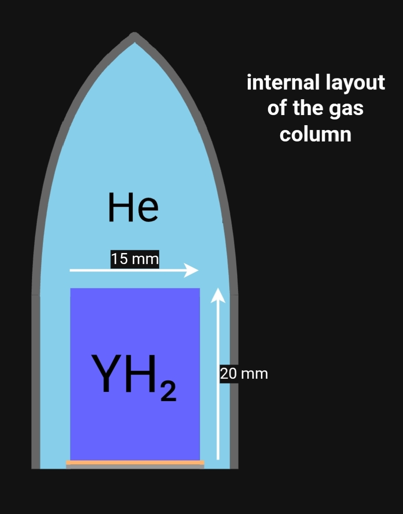

### **3. Gas Column (Aerodynamic Tip & Buffer Volume)**
**Primary Functions:** 1) Distributes and laminarizes the LH₂ coolant flow; 2) Houses the primary temperature monitoring sensor; 3) Cools the intermediate flange via an internal helium buffer.

#### **3.1. Geometry and Dimensions**
The gas column is a single-piece shell consisting of an **aerodynamic cone** (height: 30 mm) seamlessly transitioning to a **cylinder** (height: 20 mm).

*   **Key Dimensions:**
    *   **Cylindrical Base:** Outer Diameter = 24 mm, Inner Diameter = 22 mm.
    *   **Conical Tip:** Outer diameter tapers from 24 mm at the base to 2 mm at the apex. Inner diameter tapers from 22 mm to 0 mm.
    *   **Wall Thickness:** 1 mm (uniform throughout).
*   **Aerodynamic Profile:** The cone contour is defined by a set of coordinates to form a streamlined, near-parabolic shape, optimized to convert the axial LH₂ jet into a smooth, radial wall flow. The defining coordinates are provided in Table 1.
*   **Internal Geometry Rule:** At any given height (h), the inner diameter is consistently **2 mm less** than the outer diameter, maintaining the 1 mm wall thickness (e.g., at h=14 mm: d_outer=7 mm, therefore d_inner=5 mm).

**Table 1: Aerodynamic cone profile coordinates (r_outer vs. height h).**
| r_outer [mm] | Height h [mm] |
| :--- | :--- |
| 0 | 30 |
| 1 | 28.8 |
| 2 | 28 |
| 3 | 27.1 |
| 4 | 26 |
| 5 | 24.6 |
| 6 | 23 |
| 7 | 21 |
| 8 | 18.5 |
| 9 | 15.2 |
| 10 | 10.4 |
| 10.5 | 6.6 |
| 11 | 1 |
| 12 | 0 |

#### **3.2. Material, Manufacturing, and Attachment**
| Aspect | Specification |
| :--- | :--- |
| **Material** | **Inconel 718** (selected for high strength and hydrogen compatibility at cryogenic temperatures). |
| **Manufacturing** | Machined from a solid rod. The internal surface is polished to enhance heat transfer. The external aerodynamic profile is CNC-milled according to the coordinates in Table 1. |
| **Estimated Mass** | ≈ 50 g |
| **Attachment** | Joined to the **intermediate flange** via **diffusion brazing** in a vacuum furnace at ~1000 K (to the Nb-1Zr layer). Uniform clamping ensures a permanent, hermetic seal. *The intermediate flange serves as the column's integrated bottom end cap.* |

---

---

#### **3.3. Internal Components**
**A) SAW (Surface Acoustic Wave) Temperature Sensor**
The sensor is the primary health-monitoring device, located at the base of the gas column.

| Component | Specification |
| :--- | :--- |
| **Location** | At the very bottom of the gas column volume, mounted on the intermediate flange (at h = 0). |
| **Oscillator** | **Material:** LiTaO₃ (Lithium Tantalate). **Form:** Cylinder (Ø4×6 mm). **Principle:** Piezoelectric substrate whose mechanical resonant frequency shifts with temperature. |
| **Antenna** | **Material:** Ta (Tantalum). **Form:** Cylinder (Ø4×4 mm). **Principle:** Interdigital Transducers (IDT) that convert mechanical oscillations into radio signals for wireless readout. |
| **Protective Case** | **Material:** YH₂ (Yttrium Hydride). **Form:** Hermetic cylinder (Ø15×20 mm, 5 mm walls). **Functions:** Neutron shielding, thermal insulation, and mechanical protection for the sensor. **Attachment:** Brazed to the flange via a Pd interlayer at ~800 K. |
| **Internal Setup** | The sensor is suspended in a vacuum inside the case with a 0.5 mm radial gap at 300 K to accommodate thermal expansion. |
| **Estimated Mass** | ≈ 14.5 g |

**B) Helium Buffer Gas**
*   **Function:** Acts as a conductive heat-transfer medium to equalize temperature between the sensor/intermediate flange and the Inconel shell.
*   **Initial State:** Fills all remaining volume (~7.7 cm³) at a pressure of **~5 atm** and a temperature of ~300 K after assembly.

#### **3.4. Operating Principle**
1.  **Flow Management:** The incoming LH₂ jet impinges on the aerodynamic tip, which **laminarizes and radially deflects** the flow, ensuring uniform coolant distribution over the entire fuel element surface.
2.  **Thermal Management:** The internal helium buffer **conducts heat** from the high-temperature base (sensor and flange) to the cooler shell walls, where it is removed by the LH₂ flow.
3.  **Health Monitoring:** The SAW sensor **continuously monitors** the temperature at the base, providing real-time data crucial for reactor control and protection systems.

---

---

**Navigation:**
| | |
| :--- | :--- |
| **[← Back to Overview](README.md)** | Home |
| **[← Previous: LH₂ Flow](2-lh2-flow.md)** | Coolant Flow Characteristics |
| **[Next Section: Intermediate Flange →](4-intermediate-flange.md)** | Intermediate Flange Design |
