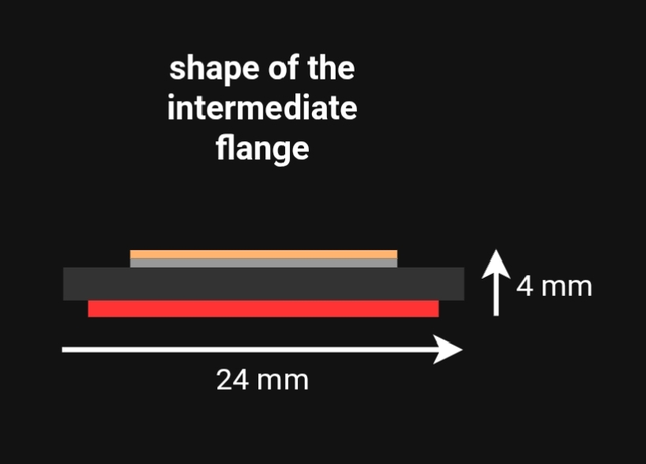
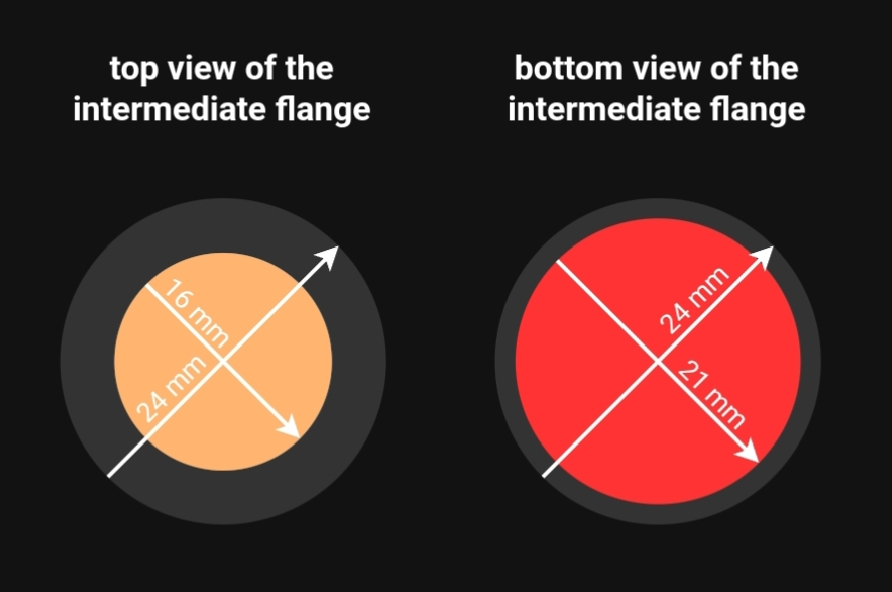
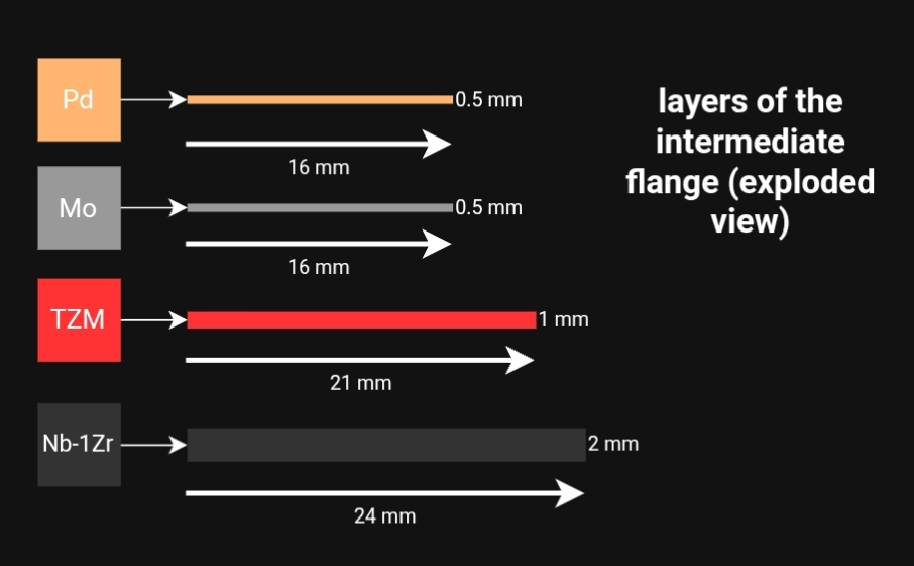

### **4) Intermediate Flange (Multi-Layer Diffusion Barrier)**

**Functions:**
1.  Separates the gas and fuel columns.
2.  Maintains helium tightness inside the columns.
3.  Serves as a base for mounting the SAW sensor.

**Construction:**
**4.1. General Shape & Layout**
*   A multi-layer cylindrical stack with varying diameters.
*   **Overall dimensions:** Ø24 mm × 4 mm (height).
*   **Layer structure (top to bottom):**
    1.  Pd (Palladium) interlayer
    2.  Mo (Molybdenum) interlayer
    3.  Nb-1Zr (Niobium-1% Zirconium) structural layer
    4.  TZM (Titanium-Zirconium-Molybdenum) diffusion barrier

*   *Note:* The Pd and Mo layers reside inside the gas column volume, while the TZM layer is inside the fuel column. The Nb-1Zr layer is integral to the fuel element's outer cladding.

---

---

**4.2. Layer Specifications**

| Layer | Material | Diameter [mm] | Height [mm] | Primary Function | Est. Mass |
| :--- | :--- | :--- | :--- | :--- | :--- |
| **1. Top** | Pd (Palladium) | 16 | 0.5 | Brazing interface for YH₂ sensor case | ≈ 1.2 g |
| **2.** | Mo (Molybdenum) | 16 | 0.5 | Intermediate brazing layer, bonds Pd to Nb-1Zr | ≈ 1.0 g |
| **3.** | Nb-1Zr | 24 | 2.0 | **Structural core:** absorbs mechanical & thermal loads | ≈ 7.8 g |
| **4. Bottom** | TZM | 20 | 1.0 | **Diffusion barrier:** blocks hot He ingress from fuel column | ≈ 1.6 g |
| | | | **Total:** | **≈ 4.0 mm** | **≈ 11.6 g** |

**4.3. Assembly Process (Step-by-Step)**
*This process is designed for a single heating cycle in a vacuum furnace with controlled temperature and pressure stages.*

1.  **Core Brazing:** The **Mo, Nb-1Zr, and TZM** layers are diffusion-brazed together at **~1500 K** under uniform axial pressure. This creates the main structural body with the Nb-1Zr layer *sandwiched* between Mo and TZM.
2.  **Cooling:** The assembly is cooled to **~1200 K**.
3.  **Sensor Platform Brazing:** The **Pd interlayer** is diffusion-brazed to the top of the Mo layer at **~1200 K**.
4.  **Final Cooling for Sensor:** The assembly is further cooled to **~800 K** to prepare for the subsequent brazing of the YH₂ sensor case (described in Section 3).
5.  **Localized Heating for Tip Attachment:** **Only the lateral (side) surface** of the Nb-1Zr layer is heated, using an electric inhibitor, to **~1000 K**. *This precise heating prevents damage to the already-brazed sensor platform.*
6.  **Tip Brazing:** The gas column tip is diffusion-brazed to the heated Nb-1Zr surface, completing the hermetic seal.

**Operating Principle:**
1.  The **Nb-1Zr layer** serves as the primary load-bearing element, absorbing vibrations and external pressure.
2.  The **Mo-Pd bi-layer** provides a reliable, high-temperature platform for rigid sensor mounting.
3.  The **TZM layer** acts as an impermeable barrier for hot helium, while efficiently conducting heat to the Nb-1Zr layer for rejection to the coolant.
4.  The **helium buffer** in the gas column actively cools the flange through direct contact.

---

---

**Navigation:**
| | |
| :--- | :--- |
| **[← Back to Overview](README.md)** | Home |
| **[← Previous: Gas Column](3-gas-column.md)** | Gas Column Design |
| **[Next Section: Fuel Column →](5-fuel-column.md)** | Fuel Column Design |
