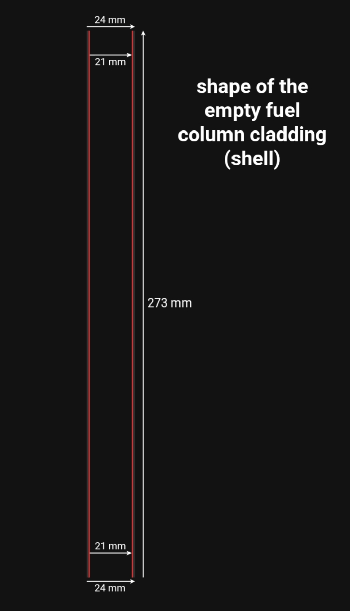
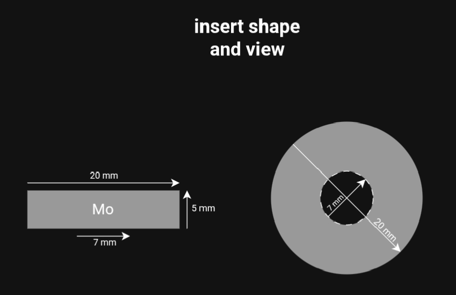
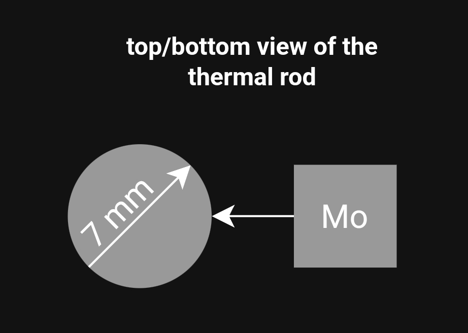
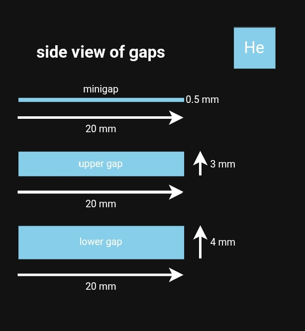
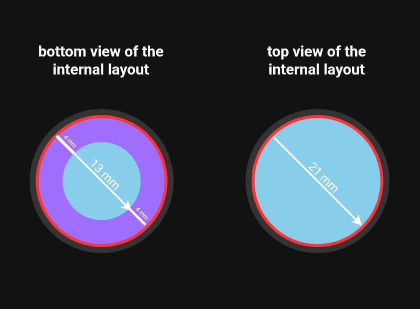
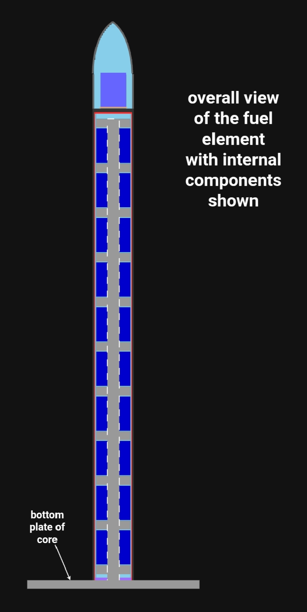

### **5) Fuel Column (Active Core)**

**Primary Functions:**
1.  **Heat Generation:** Releases thermal energy (~300 kW total) through U-235 fission reactions within fuel pellets.
2.  **Propellant Heating:** Transfers this heat through the cladding walls to the LH₂ flow.
3.  **Fission Product (FP) Management:** Removes solid and gaseous FPs from the fuel, channeling them into dedicated helium-filled collection gaps.
4.  **Structural Dynamics:** Partially absorbs core-wide vibrations while transmitting necessary loads to the intermediate flange.

#### **5.1. Dual-Layer Cladding (Pressure Shell & Heat Exchanger)**
The cladding is a **hollow cylinder** without integrated end caps, acting as the primary pressure boundary and heat exchanger.

*   **Key Dimensions:**
    *   Outer Diameter: 24 mm
    *   Inner Diameter: 21 mm
    *   Wall Thickness: 1.5 mm (composite)
    *   Height: 273 mm

*   **Layer-by-Layer Construction:**

| Layer | Material | Thickness | Primary Function | Manufacturing Process | Est. Mass |
| :--- | :--- | :--- | :--- | :--- | :--- |
| **Inner** | **TZM** (Ti-Zr-Mo) | 0.5 mm | 1. **Helium Diffusion Barrier:** Prevents hot He from the fuel column from penetrating into the structural layer. 2. **Inner Pressure Vessel:** Withstands He pressure. 3. **Heat Conduit:** Transfers heat from the internal He buffer to the outer layer. | Sheet rolling (69×273×0.5 mm) + laser-welded seam. | ~100 g |
| **Outer** | **Nb-1Zr** | 1.0 mm | 1. **Structural Shell:** Absorbs and dampens reactor vibrations. 2. **Coolant Pressure Boundary:** Withstands LH₂ flow pressure (~22 atm). 3. **Primary Heat Transfer Surface:** Directly interfaces with and heats the LH₂ coolant. | Sheet rolling (75×273×1 mm) + laser-welded seam. | ~175 g |

---

---

#### **5.2. Cladding End Attachments (Structural Interfaces)**
The dual-layer cladding must be securely integrated into the larger reactor structure at both ends. The attachment methods differ, reflecting the distinct thermal and mechanical conditions at each interface.

| Attachment Point | Method & Materials | Key Process Parameters | Purpose & Notes |
| :--- | :--- | :--- | :--- |
| **Bottom End** (To Reactor Core) | **TIG (GTAW) Welding** **Joint:** TZM cladding layer ↔ Mo layer of core lower end. | • **Weld geometry:** Circular seam. • **Weld size:** 2 mm height, 4 mm thickness. • **Procedure:** Two-pass weld (tack + strength pass) to minimize stress and prevent cracking. | Creates a **permanent, rigid, and high-strength** mechanical connection to the reactor core structure. Must withstand primary mechanical loads and conduction of excess heat to the core's cooling system. |
| **Top End** (To Intermediate Flange) | **Diffusion Brazing** **Joint:** Nb-1Zr cladding layer ↔ Nb-1Zr layer of the flange. | • **Brazing temperature:** ~1500 K. • **Process timing:** Performed **immediately after** brazing the gas column tip to the same flange, utilizing its residual heat (~1000 K). • **Clamping:** Uniform external pressure on the Nb-1Zr layer. | Creates a **hermetic, high-temperature seal**. The homogeneous material joint (Nb-1Zr to Nb-1Zr) ensures compatibility and reliability. This attachment completes the sealed volume for the helium buffer and fuel column. |

#### **5.3. Internal Core Components: Fuel, Conductors, and Structure**

The heat-generating core is a stack of fuel pellets and conductive inserts, assembled on a central thermal rod. This design prioritizes efficient heat spreading and mechanical integrity.

| Component | Qty | Material & Composition | Dimensions (Ø × h) | Primary Function | Key Parameter / Note | Est. Mass |
| :--- | :--- | :--- | :--- | :--- | :--- | :--- |
| **Fuel Pellet** | 10 | **UO₂–Mo Composite** (70% UO₂, 30% Mo) | Ø20×20 mm (Ø6.97 mm central hole) | **Heat Generation** via U-235 fission. | • **Enrichment:** 30% U-235. • **Power:** ~30 kW/pellet. • **Total Heat Area:** 22.48 cm². | ~590 g |
| **Thermal Insert** | 11 | **Pure Molybdenum (Mo)** | Ø20×5 mm (Ø6.97 mm central hole) | **Axial Heat Spreading** from pellet ends to cladding. | Ensures uniform temperature distribution along the column. | ~155 g |
| **Thermal Rod** | 1 | **Pure Molybdenum (Mo)** | Ø7×269 mm | 1. **Central Heat Conductor** (axial). 2. **Mechanical Spine** for the entire stack. | • Height allows for thermal expansion. • Brazed at base to reactor core (Mo↔Mo at ~1000 K). | ~106 g |

---

---

**Design Rationale & Key Features:**

*   **High-Conductivity Fuel Composite:** The **UO₂–Mo (70/30%)** blend is chosen to drastically improve thermal conductivity over pure UO₂, mitigating centerline melting risks. The trade-off is increased neutron absorption by Mo, necessitating higher **U-235 enrichment (30%)**.
*   **Integrated Heat-Spreading Architecture:** The **thermal rod** and **Mo inserts** work in tandem. The rod conducts heat axially from the pellet centers, while the inserts conduct it radially from the pellet ends to the cladding. This creates a multi-path heat removal system.
*   **Mechanical Assembly:** All pellets and inserts are **slid onto the single thermal rod**, forming a cohesive, self-aligning stack. The rod is permanently fixed only at its **lower base** via a reliable Mo↔Mo diffusion braze, allowing for differential thermal expansion along its length.

#### 5.4.2. Thermal Rod Stack Assembly

Pellets and inserts are mounted onto the thermal rod using **thermal interference fit**.  
No mechanical fasteners — only controlled heating and cooling.

| Step | Operation | Parameters | Notes |
|:-----|:----------|:-----------|:------|
| **1** | Heat thermal inserts (Mo) | **1100–1200 K** | Argon atmosphere |
| **2** | Heat fuel pellets (UO₂–Mo) | **700–800 K** | Separate heating cycle |
| **3** | Keep thermal rod cold | **273 K** | Ø7.00 mm |
| **4** | Slide heated parts onto rod | Their holes expand from ~∅6.97 mm to ~Ø7.00–7.02 mm | Loose fit during assembly |
| **5 | Leave 0.5 mm helium gaps (by the height of the rod)** | Laser‑marked positions | Critical for fission product sweep |
| **6** | Cool to room temperature | Natural cooling in Ar | **Interference fit achieved** — parts are locked |

**Why two different temperatures?**
- Mo inserts need **higher temperature** to expand enough (α_Mo ≈ 5×10⁻⁶).
- UO₂–Mo pellets expand more easily (α_UO₂ ≈ 10×10⁻⁶) → lower temperature is sufficient.
**Result:**  
All components are **self-locking** on the rod. No brazing, no threading, no loose parts.
### **5.4. Helium Buffer & Integrated Fission Product Management System**

Helium at an initial pressure of ~5 atm (at 300 K) fills all internal voids, serving three critical functions: 1) **Heat transfer medium**; 2) **Fission product (FP) transport fluid**; 3) **Pressure equalization buffer**.

#### **5.4.1. Functional Gap Types & Layout**
The internal volume is structured into repeating **standard gaps** and two **enlarged end gaps**. This modular design ensures heat removal and FP segregation.

| Gap Type | Total Height | Composition (Top → Bottom) | Primary Function(s) | Qty / Location |
| :--- | :--- | :--- | :--- | :--- |
| **Standard Gap** | 6.0 mm | He-minigap (0.5 mm) – Mo Insert (5 mm) – He-minigap (0.5 mm) | • **Heat Transfer:** From pellet ends via inserts to cladding. • **FP Sweep:** Carries FPs from pellets to end traps. | **9 units** *(Between each pair of pellets)* |
| **Upper Enlarged Gap** | 9.5 mm | TZM Flange (1 mm) – **Upper He-Gap (3 mm)** – Mo Insert (5 mm) – He-minigap (0.5 mm) | • **FP Collection:** Main trap for **light gaseous FPs**. • **Thermal Insulation:** Reduces heat flux to intermediate flange. | **1 unit** *(Above top pellet)* |
| **Lower Enlarged Gap** | 9.5 mm | He-minigap (0.5 mm) – Mo Insert (5 mm) – **Lower He-Gap (4 mm)** | • **FP Collection:** Main trap for **heavy FP fractions**. • **Thermal Insulation:** Reduces heat flux to lower core end. | **1 unit** *(Below bottom pellet)* |

---

---

**Total Active Stack Height Verification:** 
`(1 Upper Gap × 9.5 mm) + (10 Pellets × 20 mm) + (9 Standard Gaps × 6 mm) + (1 Lower Gap × 9.5 mm) = 273 mm`

#### **5.4.2. The Annular Helium Layer: A Critical Feature**
Beyond the axial gaps, a crucial **radial helium layer** exists between the outer diameter of the pellet/insert stack (Ø20 mm) and the inner diameter of the cladding (Ø21 mm).

*   **Thickness:** 0.5 mm (annular).
*   **Functions:**
    1.  **Radial Heat Transfer:** Conducts heat from the *side surfaces* of pellets and inserts directly to the TZM cladding layer.
    2.  **Radial FP Sweep:** Collects FPs released from pellet side surfaces and guides them towards the upper and lower collection gaps.
    3.  **Pressure Uniformity:** Ensures equal helium pressure across the entire complex internal volume.

---

---

#### **5.4.3. Integrated Fission Product Removal Pathways**
The system ensures continuous FP evacuation via helium flow:

1.  **From pellet ends** → into **adjacent He-minigaps** → axial transport → to **Upper/Lower He-gaps**.
2.  **From pellet central holes** → into **helium around thermal rod** → axial transport.
3.  **From pellet side surfaces** → into **annular helium layer** → radial transport → to **Upper/Lower He-gaps**.
4.  **Separation:** **Light gases** concentrate in the **Upper He-gap**; **Heavy fractions** settle in the **Lower He-gap**.

#### **5.5. Operating Principle & Mass Summary**

**Operating Sequence:**
1.  **Fission & Heat Generation:** U-235 fission within the **UO₂–Mo pellets** releases thermal energy (~300 kW total per fuel element).
2.  **Fission Product Management:** Gaseous and solid fission products are continuously **swept by helium** from the pellet surfaces into the dedicated **upper and lower helium traps**.
3.  **Heat Spreading & Transfer:** The generated heat is distributed:
    *   **Axially** by the **molybdenum thermal rod**.
    *   **Radially** from pellet ends by the **molybdenum inserts** and from pellet sides by the **annular helium layer**.
    *   Through the **helium-filled minigaps** to the cladding.
4.  **Final Heat Rejection:** The **dual-layer cladding (TZM/Nb-1Zr)** conducts the heat to its outer surface, where it is transferred to the **flowing LH₂ coolant**, heating it to ~4000 K for thrust generation.

**Mass Breakdown Summary:**
| Component Group | Estimated Mass | Contribution |
| :--- | :--- | :--- |
| **Cladding (TZM + Nb-1Zr)** | ~275 g | Structural shell & primary heat exchanger |
| **Internal Stack (Pellets, Inserts, Rod)** | ~851 g | Fuel, heat conductors, mechanical spine |
| **Total Fuel Column Mass** | **≈ 1.13 kg** | **~94% of total TVER mass** |

*The gas column and intermediate flange contribute the remaining ~6% to the total estimated TVER mass of ~1.2 kg.*

---

---

**Navigation:**
| | |
| :--- | :--- |
| **[← Back to Overview](README.md)** | Home |
| **[← Previous: Intermediate Flange](4-intermediate-flange.md)** | Intermediate Flange Design |
