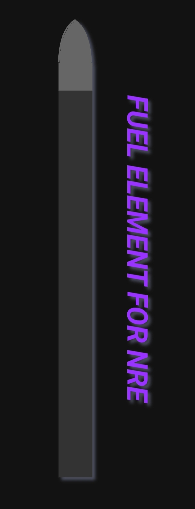

# Conceptual Design of a Fuel Element for Solid-Core Nuclear Rocket Engine

This repository contains a conceptual design for a fuel element (TVER) intended for a solid-core Nuclear Rocket Engine (NRE). The project outlines a complete architecture to enable efficient heat transfer from nuclear fission to a liquid hydrogen (LH₂) propellant — a critical step toward fast and efficient interplanetary travel.

Hi everyone. 👋 I'm 17 ☺️ and decided to dive deep into **engineering** 👨‍🏭 by tackling a real challenge: designing a **functional fuel element** (at least conceptually 😉). This element is intended for a solid-core NRE engine 💪, where the core challenge is transferring heat from **nuclear fuel directly to the LH₂ propellant.**

To better understand the context of this project 🧠, I recommend familiarizing yourself 🔬 with a few key topics:
1.  **The physics of UO₂ and nuclear fission reactions.** ☢️
2.  **The design and operating principles of nuclear fuel elements.** 🎛️
3.  **The design and history of engines like the Soviet RD-0410, an early NRE prototype.** 🚀

## 📐 Dimension Notation
In each file 📁, dimensions are indicated in the format:  
**outer diameter / inner diameter × height**, or **∅_outer / ∅_inner × h**.  
*(Example: ∅24/∅21 × 273 mm)*

## 📚 Full Article & Documentation

The full conceptual design is broken down into the following sections for easier navigation:

1.  **[General Fuel Element (TVER) Characteristics](1-general-characteristics.md)** – Key specifications, mass, power, and overall architecture.
2.  **[Coolant Flow (LH₂) Characteristics](2-lh2-flow.md)** – Parameters and principles of the liquid hydrogen cooling system.
3.  **[Gas Column (Aerodynamic Tip & Buffer)](3-gas-column.md)** – Design of the aerodynamic tip, SAW temperature sensor, and helium buffer.
4.  **[Intermediate Flange (Multi-Layer Barrier)](4-intermediate-flange.md)** – The critical sealing layer between the gas and fuel columns.
5.  **[Fuel Column (Active Core)](5-fuel-column.md)** – The heart of the element: fuel pellets, heat spreaders, helium gaps, and fission product management.
6.  **[Assembly (production) of the fuel element](6-assembly.md)** – Step-by-step manufacturing & assembly sequence, from subcomponents to finished TVER.

***(Click on any section title to read it.)***

## 🎨 Visual Documentation & Diagrams
The design is supported by **20 diagrams** created in draw.io. 🖌️ For the best experience, these diagrams are **embedded directly within each relevant section** of the documentation. Sorry if the images are crooked. 🥺🙏

## 💡 Contributing & Feedback
This is a conceptual design open for discussion. If you spot errors or have ideas for improvement:
- Open a **GitHub Issue.**
- Fork and submit a **Pull Request.**
- Or just **star the repo.** ⭐️ If you want to. 😇
**You can also leave a comment under the Reddit post.** 💬

## 👥 Credits
*   **Concept, Engineering Layout & Diagrams:** Made by **dnnvmane**.
*   **Technical Write-up, Structuring & Polishing:** Made by **dnnvmane and DeepSeek AI.** 🖤🤍🐋

---

---